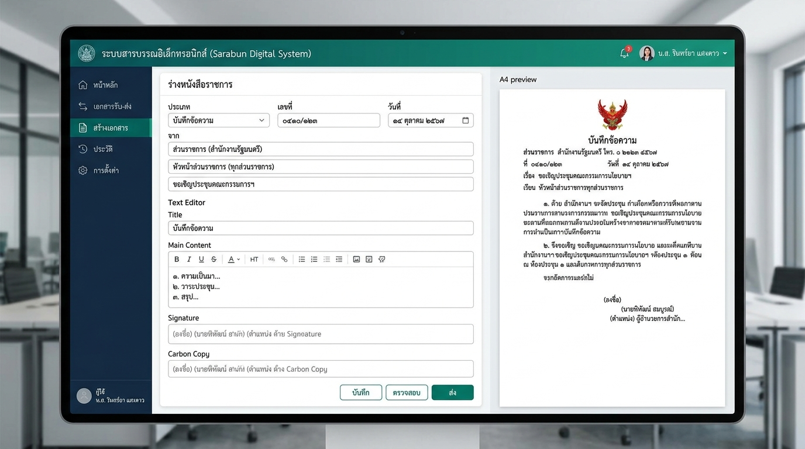
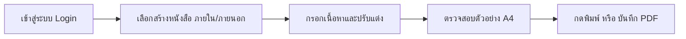

# ระบบจัดทำหนังสือราชการอิเล็กทรอนิกส์ (Thai Sarabun Electronic Document System)

[](https://creativecommons.org/licenses/by-nc/4.0/)
[](https://nodejs.org/)
[](https://react.dev/)
[](https://nestjs.com/)
[](https://www.typescriptlang.org/)

ระบบเว็บแอปพลิเคชันสำหรับร่าง แก้ไข จัดเก็บ และพิมพ์หนังสือราชการไทย (หนังสือภายใน และ หนังสือภายนอก) ให้ถูกต้องตรงตาม **ระเบียบสำนักนายกรัฐมนตรีว่าด้วยงานสารบรรณ พ.ศ. ๒๕๒๖ และที่แก้ไขเพิ่มเติม** อย่างเคร่งครัด พร้อมระบบแสดงผลแบบ A4 WYSIWYG และการตัดคำภาษาไทยที่ประณีต

---



---

## 🌟 จุดเด่นของระบบ (Key Features)

### 1. แบบฟอร์มและระยะพิมพ์ถูกต้องตามระเบียบสารบรรณ 100%
- **หนังสือภายใน (บันทึกข้อความ — อ้างอิง in01.pdf):**
  - ตราครุฑขนาด **๑.๕ เซนติเมตร** วางมุมบนซ้าย ห่างจากขอบบนกระดาษ ๑.๕ เซนติเมตร
  - หัวเรื่อง "บันทึกข้อความ" ขนาด **๒๙ พอยต์ ตัวหนา**
  - ข้อความ "ส่วนราชการ", "ที่", "วันที่", "เรื่อง" ขนาด **๒๐ พอยต์ ตัวหนา**
  - ย่อหน้าระยะบรรทัดมาตรฐาน **๒.๕ เซนติเมตร**
- **หนังสือภายนอก (อ้างอิง 03.pdf):**
  - ตราครุฑขนาด **๓ เซนติเมตร** วางกึ่งกลางหน้ากระดาษ
  - วันที่อยู่แนวกึ่งกลางตรงกับแนวตราครุฑ
  - คำลงท้าย ("ขอแสดงความนับถือ") และตำแหน่งลงนามอยู่แนวกึ่งกลางหน้ากระดาษ

### 2. การพิมพ์ A4 (Advanced Print Engine)
- แสดงตัวอย่างเอกสารขนาด **A4 จริงแบบ Side-by-Side** (แก้ไขฝั่งซ้าย อัปเดตฝั่งขวาทันที)
- ระบบ **Multi-page Pagination** คำนวณตัดหน้ากระดาษ A4 อัตโนมัติเมื่อข้อความยาวเกินหน้า
- ตัดคำภาษาไทยและการจัดแนวหน้ากระดาษแบบ **Thai Distributed Justify** ชิดขอบซ้าย-ขวาเรียบเนียน ไม่เกิดปัญหาสระลอยหรือช่องไฟกระโดด
- รองรับการสั่งพิมพ์จริงผ่านปุ่ม **พิมพ์เอกสาร** หรือ Export เป็น **PDF (Save as PDF)** ด้วยฟอนต์มาตรฐาน **TH Sarabun New**

### 3. ระบบจัดการและคลังเอกสาร (Document Management)
- หน้ารายการหนังสือแบบสลับมุมมองได้: **มุมมองตาราง (List Table)** หรือ **มุมมองการ์ด (Card Grid)**
- ระบบค้นหาด่วนแบบเรียลไทม์ (ค้นหาจากเลขที่หนังสือ, เรื่อง, หน่วยงาน, ผู้จัดทำ)
- กรองดูแยกประเภทหนังสือภายใน / หนังสือภายนอก
- บันทึกและดึงข้อมูลอัตโนมัติด้วย LocalStorage พร้อมรองรับการเชื่อมต่อ Restful API (NestJS + SQLite / Prisma)

### 4. ระบบยืนยันตัวตนความปลอดภัยสูง (User Authentication & Audit Trail)
- **ต้อง Login เข้าสู่ระบบจริง:** ในเวอร์ชันใช้งานจริง (Production) ผู้ใช้งาน **ไม่สามารถคลิกสลับผู้ใช้งานได้อย่างอิสระ** ทุกคนต้องผ่านการเข้าสู่ระบบด้วย Username และ Password ของตนเอง
- **ป้องกันการปลอมแปลงและตรวจสอบย้อนหลัง:** ข้อมูลส่วนราชการ, สังกัดกอง/ฝ่าย, เบอร์โทรศัพท์, รหัสเลขที่หนังสือประจำกอง และชื่อผู้ลงนาม จะถูกผูกกับบัญชีที่ผ่านการพิสูจน์สิทธิ์แล้วโดยอัตโนมัติ

---

## 🚀 วิธีติดตั้งและเริ่มต้นใช้งาน (Installation & Quick Start)

### ความต้องการของระบบ (Prerequisites)
- [Node.js](https://nodejs.org/) เวอร์ชั่น 18.0.0 ขึ้นไป
- [npm](https://www.npmjs.com/) หรือ yarn / pnpm

### 1. โคลน Repository
```bash
git clone https://github.com/thribbles/sarabun.git
cd sarabun
```

### 2. ติดตั้ง Dependencies
```bash
npm install --prefix sarabun-system
```

### 3. รันโปรเจกต์สำหรับทดสอบ (Development Mode)

#### 🔹 รันเฉพาะระบบหน้าบ้าน (Frontend Web Client - พอร์ต 3000):
```bash
npm run dev:web
```
เปิดเว็บเบราว์เซอร์ไปที่: **[http://localhost:3000](http://localhost:3000)**

#### 🔹 (ทางเลือก) รันระบบหลังบ้าน (Backend API NestJS + SQLite - พอร์ต 3001):
```bash
npm run dev:api
```

---

## 📖 คู่มือการใช้งานระบบ (User Guide)



1. **เข้าสู่ระบบ (Login เข้าใช้งาน):**
   - ผู้ใช้งานต้องเข้าสู่ระบบด้วย Username และ Password เพื่อยืนยันตัวตน (เวอร์ชันจริงไม่สามารถคลิกสลับบัญชีได้ ต้อง Login เท่านั้น)
   - ระบบจะดึงข้อมูลส่วนราชการ, เลขรหัสหนังสือประจำกอง (เช่น `ปจ ๕๑๐๐๑/`), และเบอร์โทรศัพท์ของกอง/ฝ่ายที่สังกัดให้โดยอัตโนมัติ
2. **เลือกสร้างหนังสือราชการ:**
   - ที่หน้าหลัก กดปุ่ม **"+ หนังสือภายใน"** (บันทึกข้อความ) หรือ **"+ หนังสือภายนอก"** (หนังสือออกภายนอกหน่วยงาน)
3. **กรอกเนื้อหาและร่างเอกสาร:**
   - กรอก **เรื่อง**, **เรียน**, **เนื้อหาบันทึกข้อความ**, และ **ชื่อ-ตำแหน่งผู้ลงนาม**
   - สามารถพิมพ์เลขอารบิกแล้วกดแปลงเป็น **เลขไทย (๐-๙)** ได้ทันที
4. **ตรวจสอบตัวอย่าง A4 (A4 Preview):**
   - ดูตัวอย่างขนาดและการจัดหน้ากระดาษ A4 จริงทางด้านขวามือ (WYSIWYG)
   - สามารถเปิดไม้บรรทัด/เส้นไกด์ขอบกระดาษ (Margins Guide: ซ้าย ๓ ซม., ขวา ๒ ซม., บน ๒.๕ ซม., ล่าง ๒ ซม.)
5. **สั่งพิมพ์เอกสาร:**
   - กดปุ่ม **"🖨️ พิมพ์เอกสาร"** บนแถบเครื่องมือ
   - หน้าต่างพิมพ์ของเบราว์เซอร์จะเปิดขึ้นมา ให้เลือกปลายทางเป็น **เครื่องพิมพ์** หรือ **Save as PDF**
   - *(แนะนำตั้งค่าขอบกระดาษในการพิมพ์ของเบราว์เซอร์เป็น "None" หรือ "เริ่มต้น" เพื่อให้ได้ขนาดตามสเกลที่ระบบคำนวณไว้)*

---

## 📁 โครงสร้างโปรเจกต์ (Project Structure)

```text
sarabun/
├── docs/                        # เอกสารระบบและรูปภาพตัวอย่าง
│   └── images/
│       └── sarabun_preview.jpg  # ภาพตัวอย่างระบบ
├── sarabun-system/
│   ├── apps/
│   │   ├── web/                 # Frontend (React + Vite + TypeScript)
│   │   │   ├── components/
│   │   │   │   ├── auth/        # ระบบยืนยันตัวตน/โปรไฟล์สังกัด
│   │   │   │   ├── editor/      # ฟอร์มกรอกและร่างเอกสาร
│   │   │   │   ├── list/        # หน้ารายการและคลังเอกสาร
│   │   │   │   └── print/       # ตัวแสดงผลตราครุฑและจัดหน้าพิมพ์ A4
│   │   │   ├── public/fonts/    # ฟอนต์มาตรฐาน TH Sarabun New
│   │   │   └── src/
│   │   │       ├── App.tsx      # ส่วนประกอบหลักของเว็บ
│   │   │       ├── authTypes.ts # ข้อมูลสังกัด/ฝ่าย
│   │   │       └── documentStore.ts # ระบบจัดเก็บเอกสาร
│   │   └── api/                 # Backend (NestJS + Prisma + SQLite)
│   │       └── src/
│   │           ├── documents/   # โมดูลและคอนโทรลเลอร์เอกสาร
│   │           └── prisma/      # ฐานข้อมูลและ Schema
│   └── packages/
│       └── shared-types/        # Data Types ที่ใช้ร่วมกัน
├── LICENSE                      # ข้อกำหนดการใช้งาน (CC BY-NC 4.0)
└── README.md                    # เอกสารแนะนำและคู่มือการใช้งาน
```

---

## ⚖️ ข้อกำหนดสิทธิการใช้งานและเครดิต (License & Credits)

ซอฟต์แวร์นี้เผยแพร่ภายใต้ใบอนุญาต **Creative Commons Attribution-NonCommercial 4.0 International (CC BY-NC 4.0)**

### เงื่อนไขสำคัญ:
1. **ให้เครดิตผู้สร้างเดิมเสมอ (Attribution):** ต้องระบุที่มาและให้เครดิตผู้พัฒนาเดิม คือ **Saksith Sinarun**
2. **ห้ามใช้เชิงพาณิชย์ (Non-Commercial):** **ห้ามนำซอฟต์แวร์ ส่วนหนึ่งส่วนใดของโค้ด หรือระบบนี้ไปจำหน่าย แสวงหาผลกำไร หรือใช้ในเชิงพาณิชย์โดยเด็ดขาด**
3. **อนุญาตให้นำไปใช้เพื่อประโยชน์สาธารณะ:** อนุญาตให้นำไปศึกษา ปรับปรุง แจกจ่าย และใช้งานภายในองค์กรหรือหน่วยงานราชการได้ฟรี

> **ผู้พัฒนาเดิม (Original Creator):**  
> **Saksith Sinarun**  
> GitHub: [@thribbles](https://github.com/thribbles)  
> Repository: [https://github.com/thribbles/sarabun](https://github.com/thribbles/sarabun)
